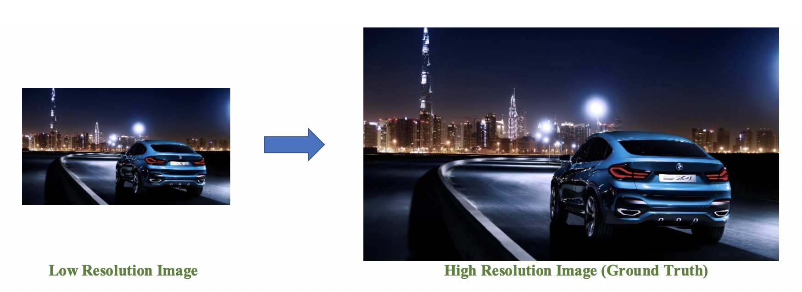

# Project: Can you unscramble a blurry image? 


### [Full Project Description](doc/project3_desc.md)

Term: Fall 2018

+ Group 1
+ Team members (Alphabetically)
	+ Min Jin
	+ Yukun Pei (Presenter)
	+ Atishay Sehgal
	+ Wenting Yu
	+ Lingyi Zhao

+ Project summary: In this project, our client is interested in creating an mobile AI program that can enhance the resolution of blurry and low-resolution images. we created a classification engine for enhancement of the resolution of images. We implemented a baseline Gradient Boosting Model and some of the improvements we offer are using XGBoost and Support Vector Machines.
+ Project goal: Produce a predicted high resolution image as output based on the low-resolution input that is as close to the ground truth as possible.
+ Model used:
	+ Baseline: GBM(depth = 1, ntree = 100, minNode = 14, shrinkage = 0.09)
	+ Improvement: XGBoost(depth = 5, nrounds = 11, eta = 0.5)
	+ Other try: Random Forest, SVM and CNN
+ Model evaluation: Peak Signal-to-noise Ratio (PSNR) and Mean Squared Error (MSE)
+ Project Criteria: 
	+ The portability of this AI program (holding storage and memory cost)
	+ The computational efficiency (test running time cost)

**Goal and Performance Example**:




**Contribution statement**: ([default](doc/a_note_on_contributions.md)) (Alphabetically)

Min Jin: Designed feature.R and superResolution.R along with transfering all codes to Python to improve speed.

Yukun Pei (Presenter): Presentation, tuned parameters, debugged baseline model from other group members and make PPT of presentation.

Atishay Sehgal: Worked on SVM, XGBoost and CNN as baseline improvements. Worked on tuning parameters for the same. 

Wenting Yu: Designed feature.R and superResolution.R part. Tuned parameters for baseline model (gbm model) and gave the FINAL VERSION of baseline model.  

Lingyi Zhao: Designed xgboost and random forest models. Tuned parameters for xgboost and gave FINAL VERSION of xgboost model.


Following [suggestions](http://nicercode.github.io/blog/2013-04-05-projects/) by [RICH FITZJOHN](http://nicercode.github.io/about/#Team) (@richfitz). This folder is orgarnized as follows.

```
proj/
├── lib/
├── data/
├── doc/
├── figs/
└── output/
```

Please see each subfolder for a README file.

